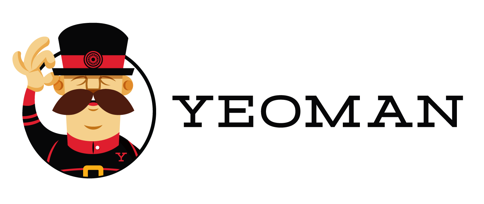

[](http://badge.fury.io/js/generator-baumeister)
[](https://travis-ci.org/micromata/generator-baumeister)
[](https://coveralls.io/github/micromata/generator-baumeister?branch=master)
[](https://david-dm.org/micromata/generator-baumeister#info=devDependencies)
[](https://david-dm.org/micromata/generator-baumeister#info=Dependencies)
[](CODE_OF_CONDUCT.md)
[](https://gitter.im/micromata/baumeister?utm_source=badge&utm_medium=badge&utm_campaign=pr-badge&utm_content=badge)
[](https://twitter.com/BootstrapKick)
[](https://www.youtube.com/watch?v=qRC4Vk6kisY) 


# Yeoman Generator for »Baumeister«


    	 _-----_
	    |       |    .--------------------------.
	    |--(o)--|    |   Yeoman Generator for   |
	   `---------´   |       »Baumeister«       |
	    ( _´U`_ )    '--------------------------'
	    /___A___\    
	     |  ~  |     
	   __'.___.'__   
	 ´   `  |° ´ Y ` 


Using this generator will give you a solid base for your Bootstrap based project in a matter of minutes. It will offer you some neat options for using »Baumeister« which will help you with the creation of Bootstrap themes and sites by providing a file structure with focus on maintainibilty and upgradability and a set of useful Grunt Tasks. 

Please check the epic [README](https://github.com/micromata/baumeister) of »Baumeister« to get detailed information about what it’s all about.

## Features of this generator

There are tons of options for now :scream:  
… but dont be afraid – most of them are optional and you even get to see them all because some are depending on others. Plus the ones that probably don’t change from one project to the other are stored for your convenience.

| Option  | Description |
| ------------- | ------------- |
| `projectName` | Used in the generated README and package.json  |
| `projectDescription`  | Used in the generated README and package.json  |
| `theme`  | Name of your Bootstrap theme. Used to name a file and a folder within the LESS directory  |
| `projectType` | Adds static site generator abilities (using Handlebars and Frontmatters) if you choose to build a static website |
| `customPaths`  | Option to define the output paths `dist`, `docs`, `reports`  |
| `boilerplateAmount`  | Option to choose the amount of boilerplate code (HTML, LESS and JS examples)  |
| `license`  | Option to define the license type. Defaults to MIT  |
| `initialVersion`  | Option to define the initial version number used in generated package.json. Defaults to 0.0.0  |
| `authorName`  | Option to define the author for use in the generated package.json and JavaScript files  |
| `authorMail`  | Option to define the author for use in the generated package.json and JavaScript files  |
| `authorUrl`  | Option to define the author for use in the generated package.json |
| `projectHomepage`, `projectRepositoryType`, `projectRepository`  | Option to define homepage and repository for use in the generated package.json  |
| `issueTracker`  | Option to define the URL to your issue tracker for use in the generated package.json  |
| `banner`  | Optionally adds a comment banner containing author name, version and build date to your production files (CSS and JS)  |
| `addDistToVersionControl`  | Option to decide whether to add the `dist` directory to version control or include it in `.gitignore` |

Frequent Users, who are tired being asked the same questions again and again might use a config file called `.yo-rc.json` like described [here](#--yo-rc).

---


## Quick install guide

For those already using Yeoman.

```bash
npm install -g generator-baumeister
yo baumeister
```
---

## Dependencies

- Node.js
- Grunt

See detailed installation instructions [over here](https://github.com/micromata/baumeister#dependencies) if you are new to this.

## Getting Started

### What is Yeoman?

Trick question. It's not a thing. It's this guy:

[](http://yeoman.io/)

Basically, he wears a top hat, lives in your computer, and waits for you to tell him what kind of application you wish to create.

Not every new computer comes with a Yeoman pre-installed. He lives in the [npm](https://npmjs.org) package repository. You only have to ask for him once, then he packs up and moves into your hard drive. *Make sure you clean up, he likes new and shiny things.*

```bash
npm install -g yo
```

### Yeoman Generators

Yeoman travels light. He didn't pack any generators when he moved in. You can think of a generator like a plug-in. You get to choose what type of application you wish to create, such as a Backbone application or even a Chrome extension.

To install generator-baumeister from npm, run:

```bash
npm install -g generator-baumeister
```

Finally, initiate the generator:

```bash
yo baumeister
```

### Options via command line flags

#### --skip-cache 

> Do not remember prompt answers for next run of the generator

Default: false

```bash
yo baumeister --skip-cache
```

#### --skip-install

> Do not automatically install dependencies

Default: false

```bash
yo baumeister --skip-install
```

#### --yo-rc

> Read and apply options from .yo-rc.json and skip prompting

Default: false

```bash
yo baumeister --yo-rc
```

You could place a  `.yo-rc.json` in the directory you are going to run the generator or in any parent directory up to your user directory (`~/.yo-rc.json`)

This file should contain the options which are otherwise prompted by Yeoman. See the follwoing example `.yo-rc.json`:

```json
{
  "generator-baumeister": {
    "projectName": "foozy",
    "projectDescription": "boozy",
    "banner": false,
    "projectType": "A static website (Static site generator using Handlebars and Frontmatters)",
    "theme": "foozel",
    "boilerplateAmount": "Almost nothing - Just the minimum files and folders",
    "license": "MIT",
    "authorName": "Michael Kühnel",
    "authorUrl": "http://micromata.de",
    "authorMail": "me@foobar.com",
    "projectHomepage": "",
    "projectRepository": "",
    "issueTracker": "",
    "customPaths": true,
    "distDirectory": "myDist",
    "docsDirectory": "myDocs",
    "reportsDirectory": "myReports",
    "initialVersion": "1.0.0",
    "addDistToVersionControl": true
  }
}
```

See [Features of this generator](#features-of-this-generator).

### Getting To Know Yeoman

Yeoman has a heart of gold. He's a person with feelings and opinions, but he's very easy to work with. If you think he's too opinionated, he can be easily convinced.

If you'd like to get to know Yeoman better and meet one of his best friends, [Grunt](http://gruntjs.com), check out the complete [Getting Started Guide](https://github.com/yeoman/yeoman/wiki/Getting-Started).


## Contributing to this project

Anyone and everyone is welcome to contribute. Please take a moment to
review our [Code of Conduct](CODE_OF_CONDUCT.md) as well as our [guidelines for contributing](CONTRIBUTING.md).

* [Bug reports](CONTRIBUTING.md#bugs)
* [Feature requests](CONTRIBUTING.md#features)
* [Pull requests](CONTRIBUTING.md#pull-requests)

## License

Please be aware of the licenses of the components we use in this project.
Everything else that has been developed by the contributions to this project is under [MIT License](LICENSE).
